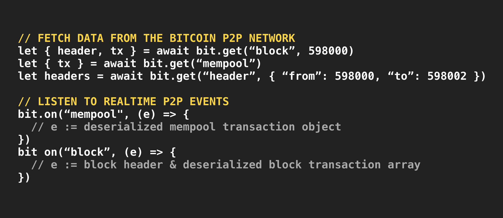
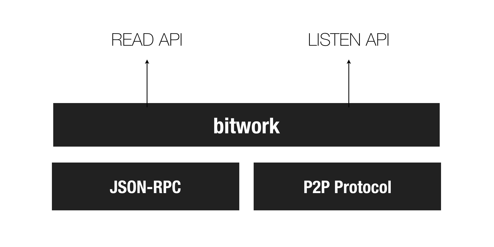
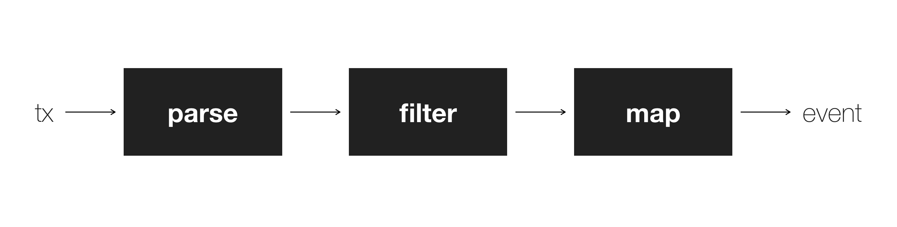
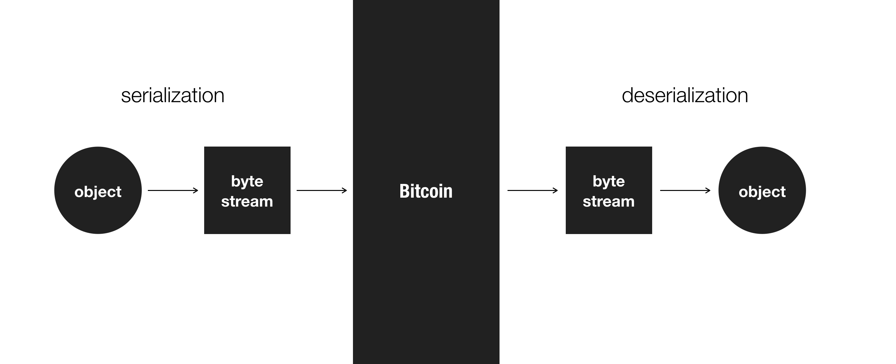
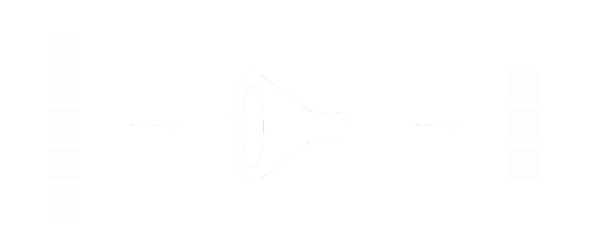
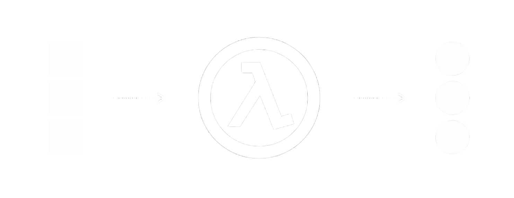

# bitwork

> Bitcoin networking made simple.

[View Full Documentation](https://bitwork.network)

bitwork is the easiest, yet powerful way to process data from the bitcoin network.

It makes interacting with bitcoin as easy as making an HTTP GET request, or listening to WebSockets!



It abstracts the complex and esoteric low level networking APIs (P2P protocol + JSON-RPC) into a unified, easy-to-use interface that resembles a simple HTTP request.



Underneath, bitwork takes care of all the complexities in fetching and listening to data from the P2P network, as well as make use of the JSON-RPC API for some features which when combined, enables an extremely user-friendly yet powerful API.

Finally, it has [a built-in data processing engine](#_3-use) which parses the incoming transaction byte stream into structured programmable objects which makes programmers' jobs significantly easier.

---

# Who is this for?

This library is for **reading DIRECTLY from a bitcoin node,** which means this is for those **who run a bitcoin node of their own**. If you already have access to a Bitcoin node via JSON-RPC and P2P, this library is for you.

> NOTE: Most developers shouldn't need to run their own bitcoin node as it will become exponentially harder to maintain as the blockchain grows. (For example, it is already possible for blockchains like Bitcoin SV to grow at a speed of 2GB per block, which is approximately 10 minutes)
>
> Instead, look into solutions for synchronizing only the required data subset **without having to run a node**. See [Bitbus](https://bitbus.network).


---

# What problems does it solve?

What problems does Bitwork solve? 

Short answer: Everything related to Bitcoin data processing. 

Long answer:

## 1. P2P

Working with the P2P protocol directly is very tedious and has a lot of unintuitive limitations. Let's just take one example: the `"getheaders"` API. Here's a description of how it works:

> "Return a headers packet containing the headers of blocks starting right after the last known hash in the block locator object, up to hash_stop or 2000 blocks"

There are several problems here:

1. First, you can only get headers for 2000 blocks at a time.
2. Second, "blocks starting **right after** the last known hash", which means if you say "Get headers from hash X to Y", it **will NOT include the block X itself**! Such a simple query is tedious if you're directly trying to use the P2P protocol.
3. Third, you can only use block hash to query headers, no height. Again, tedious.

Another example, the header returned by the P2P protocol doesn't include a `"nextblockhash"` field. This is understandable if we remember that the main purpose of the P2P protocol is for block propagation (and not for querying). However it's still true that it's inconvenient (You can get this information through JSON-RPC)

Also due to its P2P nature, developers must programm in a [message passing pattern](https://en.wikipedia.org/wiki/Message_passing) when trying to process data from the blockchain. This means you call a `sendMessage` to make a request, and then also implement a separate event listener which listens to data from the network and distinguish random data from the actual response you're expecting. This creates a messy [spaghetti code](https://en.wikipedia.org/wiki/Spaghetti_code) and is not desirable. Ideally you should be able to **interact with the P2P network with just a few lines of code, just like you would with HTTP.**

Bitwork solves these problems by functioning as an abstraction layer which frees developers from having to worry about all these quirks.

**Bitwork lets you treat Bitcoin like HTTP.**

## 2. JSON-RPC

JSON-RPC is meant to be a more user friendly way to query the blockchain, but the performance is worse than P2P. Currently it doesn't support streaming, so it takes up a lot of memory and often crashes the node itself when the block is too large. (This is a new type of problem only possible in a scaling blockchain like Bitcoin SV)

There are also several other performance and synchronization issues with JSON-RPC. It's better to use the P2P protocol directly when possible.

**Bitwork mostly uses the P2P protocol directly, and uses JSON-RPC methods when it's necessary.**

## 3. ZeroMQ

Working with Zeromq to listen to blockchain events is sketchy. It has synchronization issues with the JSON-RPC API. For example sometimes there will be a ZeroMQ event trigger, but the JSON-RPC won't return a response when you query the same event immediately, and you will have to try another query several seconds later. This is more severe during peak transaction periods, which is when the realtime feature matters the most.

One solution to mitigate this issue is to never trust Zeromq 100% and use a hybrid approach of ZeroMQ plus constant polling.

But this is a mediocre solution at best, and there is no reason to do this if we directly listen to the P2P network.

**Bitwork directly listens to the P2P network instead of relying on ZeroMQ.**

## 4. Usability

There simply does not exist a single high level API that makes interacting with a Bitcoin node as simple as making a HTTP request.

Bitwork makes everything simple, and will get rid of all your headaches dealing with Bitcoin data.

**It just works.**

---

# Install

First install the package to your app folder

```
npm install --save bitwork
```

---

# Usage

First you must initialize it:

```
const bitwork = require('bitwork')
const bit = new bitwork({ rpc: { user: "root", pass: "bitcoin" } })
bit.on("ready", () => {
  // YOUR LOGIC
})
```

The constructor can take the following attributes:

- `rpc`: RPC settings
  - `protocol`: JSON-RPC access protocol (**optional.** default: "http")
  - `host`: JSON-RPC endpoint IP (**optional.** default: "127.0.0.1")
  - `port`: JSON-RPC port (**optional.** default: 8332)
  - `user`: JSON-RPC username (**required**)
  - `pass`: JSON-RPC password (**required**)
- `peer`: P2P settings
  - `host`: Peer IP to connect to (**optional.** default: 127.0.0.1)

---

# Quickstart

Let's try.

First, install bitwork

```
npm install --save bitwork
```

Second, create a file `listener.js`.

```
const bitwork = require('bitwork')
// Remember to replace the "user" and "pass" with your OWN JSON-RPC username and password!
const bit = new bitwork({ rpc: { user: "root", pass: "bitcoin" } })
bit.on("ready", async () => {
  bit.on("mempool", (e) => {
    console.log(e)
  })
})
```

run

```
node listener
```

That's it! You'll start seeing new transactions flow in, in realtime.

Next, let's try reading a block. Create another file `read.js`:

```
const bitwork = require('bitwork')
// Remember to replace the "user" and "pass" with your OWN JSON-RPC username and password!
const bit = new bitwork({ rpc: { user: "root", pass: "bitcoin" } })
bit.on("ready", async () => {
  let { header, tx } = await bit.get("block", 598924)
  console.log("block header = ", header)
  console.log("block transactions = ", tx)
})
```

and run:

```
node read
```

You'll get the full block content for block height 598924!

---

# API

There are three API methods:

1. **get:** fetch data from the blockchain.
2. **on:** listen to data from the blockchain.
3. **use:** attach middleware.

## 1. get

### a. mempool

#### Syntax

```
bit.get("mempool").then((mepool) => {
  //  mempool := {
  //    tx: <array of mempool transactions>
  //  }
})
```

#### Example

Get mempool transactions

```
const bitwork = require('bitwork')
const bit = new bitwork({ rpc: { user: "root", pass: "bitcoin" } })
bit.on("ready", () => {
  bit.get("mempool").then((mempool) => {
    console.log("mempool transactions = ", mempool.tx)
  })
})
```

or using async/await:

```
const bitwork = require('bitwork')
const bit = new bitwork({ rpc: { user: "root", pass: "bitcoin" } })
bit.on("ready", async () => {
  let mempool = await bit.get("mempool");
  console.log("mempool transactions = ", mempool.tx)
})
```

### b. block

#### Syntax

```
bit.get("block", <hash|height>).then((block) => {
  //  block := {
  //    header: <block header object>,
  //    tx: <array of mempool transactions>
  //  }
})
```


#### Example


Get by block height

```
const bitwork = require('bitwork')
const bit = new bitwork({ rpc: { user: "root", pass: "bitcoin" } })
bit.on("ready", async () => {
  let block = await bit.get("block", 598924)
  console.log("block header = ", block.header)
  console.log("block transactions = ", block.tx)
})
```

Get by block hash

```
const bitwork = require('bitwork')
const bit = new bitwork({ rpc: { user: "root", pass: "bitcoin" } })
bit.on("ready", async () => {
  let block = await bit.get("block", "000000000000000000a3ec7e52e0f3fea4a4e6a2e3a3b1a9c473aeb36daa0076")
  console.log("block header = ", block.header)
  console.log("block transactions = ", block.tx)
})
```

### c. header

#### Syntax

```
bit.get("header", <Query>).then((headers) => {
  //  headers := <array of headers>
})
```

Where the `<Query>` is an object which may have the following attributes:

- `at`: Specify the exact position of the block (hash or height).
- `from`: Specify the position to fetch from (hash or height)
- `to`: Specify the position to end fetching (hash or height)

#### Example

Get a block header at a specific height:

```
const bitwork = require('bitwork')
const bit = new bitwork({ rpc: { user: "root", pass: "bitcoin" } })
bit.on("ready", async () => {
  let header = await bit.get( "header", { at: 598848 })
  console.log("header = ", header)
})
```

Get a block header at a specific hash:

```
const bitwork = require('bitwork')
const bit = new bitwork({ rpc: { user: "root", pass: "bitcoin" } })
bit.on("ready", async () => {
  let header = await bit.get( "header", { at: "000000000000000000a3ec7e52e0f3fea4a4e6a2e3a3b1a9c473aeb36daa0076" })
  console.log("header = ", header)
})
```

Get block headers starting from a height, until the end (blockchain tip)

```
const bitwork = require('bitwork')
const bit = new bitwork({ rpc: { user: "root", pass: "bitcoin" } })
bit.on("ready", async () => {
  let headers = await bit.get(
    "header", 
    { from: 598848 }
  )
  console.log("headers = ", headers)
})
```

Get block headers starting from a block hash, until the end (blockchain tip)

```
const bitwork = require('bitwork')
const bit = new bitwork({ rpc: { user: "root", pass: "bitcoin" } })
bit.on("ready", async () => {
  let headers = await bit.get( "header", { from: "000000000000000000a3ec7e52e0f3fea4a4e6a2e3a3b1a9c473aeb36daa0076" })
  console.log("headers = ", headers)
})
```

Get block headers between two heights:

```
const bitwork = require('bitwork')
const bit = new bitwork({ rpc: { user: "root", pass: "bitcoin" } })
bit.on("ready", async () => {
  let headers = await bit.get( "header", { from: 598848, to: 598850 })
  console.log("headers = ", headers)
})
```

Get block headers between a height and a hash:


```
const bitwork = require('bitwork')
const bit = new bitwork({ rpc: { user: "root", pass: "bitcoin" } })
bit.on("ready", async () => {
  let headers = await bit.get("header", { from: "000000000000000000a3ec7e52e0f3fea4a4e6a2e3a3b1a9c473aeb36daa0076", to: 598850 })
  console.log("headers = ", headers)
})
```

### d. JSON-RPC

#### Syntax

```
bit.get("rpc", <JSON-RPC method>, ...<JSON-RPC arguments>).then((response) => {
  // response := <JSON-RPC response> 
}).catch((e) => {
  // e := <error message>
})
```

Where `<JSON-RPC method>` may be ANY of the methods shown at https://github.com/bitpay/bitcoind-rpc/blob/master/lib/index.js#L160

#### Example

```
const bitwork = require('bitwork')
const bit = new bitwork({ rpc: { user: "root", pass: "bitcoin" } })
bit.on("ready", async () => {
  let info = await bit.get("rpc", "getInfo")
  console.log("info = ", info)
})
```

will print something like:

```
info =  {
  version: 100020100,
  protocolversion: 70015,
  blocks: 598980,
  timeoffset: 0,
  connections: 41,
  proxy: '',
  difficulty: 129757875307.3484,
  testnet: false,
  stn: false,
  paytxfee: 0,
  relayfee: 0.00001,
  errors: "Warning: Unknown block versions being mined! It's possible unknown rules are in effect",
  maxblocksize: 2000000000,
  maxminedblocksize: 128000000
}
```

You can also pass additional arguments;

```
const bitwork = require('../index')
const bit = new bitwork({ rpc: { user: "root", pass: "bitcoin" } })
bit.use("parse", "bob")
bit.on("ready", async () => {
  let tx = await bit.get("rpc", "getRawTransaction", "da80aa6f5a21b41485b73d268af1d3f89d360cd5c6147b4214af8d5add612b12")
  console.log('tx = ', tx)
})
```

---

## 2. on

The `on` method lets you create an event listener:

### a. mempool

Listen to realtime incoming mempool transactions via P2P

#### Syntax

```
bit.on("mempool", (e) => {
  //  e := <new transaction object>
})
```

#### Example

```
const bitwork = require('bitwork')
const bit = new bitwork({ rpc: { user: "root", pass: "bitcoin" } })
bit.on("ready", async () => {
  bit.on("mempool", (e) => {
    console.log("New transaction = ", e)
  })
})
```

### b. block

Listen to realtime incoming blocks via P2P

#### Syntax

```
bit.on("block", (e) => {
  //  e := {
  //    header: <new block header>,
  //    tx: <array of transaction objects in the block>
  //  }
})
```

#### Example

```
const bitwork = require('bitwork')
const bit = new bitwork({ rpc: { user: "root", pass: "bitcoin" } })
bit.on("ready", async () => {
  bit.on("block", (e) => {
    console.log("header = ", e.header)
    console.log("transactions = ", e.tx)
  })
})
```

### c. ready

Must use before calling any other methods:

```
const bitwork = require('bitwork')
const bit = new bitwork({ rpc: { user: "root", pass: "bitcoin" } })
bit.on("ready", () => {
  // YOUR APP LOGIC GOES HERE
})
```

---

## 3. use

The `use` method is used for attaching middleware.



There are three middleware types:

1. **Parse:** The parser which deserializes an incoming raw transaction into any format that's easy to use in programs.
2. **Filter:** Filter the transactions based on a tester function.
3. **Map:** Transform the transactions through a map function.

> Note that these three steps are executed in this specific order. The transaction goes through a parser, and then gets filtered, and finally mapped.


The processors are attached to bitwork through the following syntax:

```
bit.use(<processor>, <name or lambda function>)
```


### a. parse

`parse` is the first step. parse is used for deserializing an incoming raw transaction byte stream into a JavaScript object.



Here are the parsers currently supported natively:

1. bob: https://medium.com/@_unwriter/hello-bob-94701d278afb
2. txo: https://github.com/interplanaria/txo
3. hex: raw hex string format

To use BOB, simply add `bit.use("parse", "bob")`

```
const bitwork = require('bitwork')
const bit = new bitwork({ rpc: { user: "root", pass: "bitcoin" } })
bit.use("parse", "bob")
bit.on("ready", async () => {
  let blk = await bit.get("block", 598966)
  console.log(JSON.stringify(blk, null, 2))
})
```

This will give you:

1. `"header"`: the block header for 598966
2. `"tx"`: all transactions in block 598966, DESERIALIZED with BOB.

Which looks like this:

<pre class='scroll'><code>
{
  "header": {
    "hash": "000000000000000002b888b9b9d806b27103df8ebf29dfc359f9d4e6ef4cc427",
    "version": 549453824,
    "prevHash": "0000000000000000006d8e25371046c57f9cbbe251d84b1d0c636721de23c5e7",
    "merkleRoot": "8c9bbd17117f0d3848d6089ea1e7ef2dfd310e0e5a61bf9d4ac2cf4b9d994ca7",
    "time": 1567860575,
    "bits": 403221253,
    "nonce": 1908806409,
    "height": 598966
  },
  "tx": [
    {
      "tx": {
        "h": "03f4052af378df64d5f416c7174d088178f2a679b67a451956f1d3c1c65b4f01"
      },
      "in": [],
      "out": [
        {
          "i": 0,
          "tape": [
            {
              "cell": [
                {
                  "op": 118,
                  "ops": "OP_DUP",
                  "ii": 0,
                  "i": 0
                },
                {
                  "op": 169,
                  "ops": "OP_HASH160",
                  "ii": 1,
                  "i": 1
                },
                {
                  "b": "TBICBeU94joq/WU8fS3P9NMyAbg=",
                  "s": "L\u0012\u0002\u0005�=�:*�e<}-���2\u0001�",
                  "ii": 2,
                  "i": 2
                },
                {
                  "op": 136,
                  "ops": "OP_EQUALVERIFY",
                  "ii": 3,
                  "i": 3
                },
                {
                  "op": 172,
                  "ops": "OP_CHECKSIG",
                  "ii": 4,
                  "i": 4
                }
              ],
              "i": 0
            }
          ],
          "e": {
            "v": 1250008636,
            "i": 0,
            "a": "17wDvnpvv7XSWjMRfnhjcdvY6jzonNKL5A"
          }
        }
      ],
      "blk": {
        "i": 598966,
        "h": "000000000000000002b888b9b9d806b27103df8ebf29dfc359f9d4e6ef4cc427",
        "t": 1567860575
      }
    },
    ....
    {
      "tx": {
        "h": "b4e1bdb6177ece9b75d8450c47e6c1240504409e8f61bad5a8f3bcb48fff67ad"
      },
      "in": [
        {
          "i": 0,
          "tape": [
            {
              "cell": [
                {
                  "b": "MEUCIQCvPs7z6JFpu31mhEQvzxZB1i7xJIb3p1ULsbvHsf1u1AIgTMBvTY5079UbyNyKUmPnUjPD5osBteLzzErHrRUGsWpB",
                  "s": "0E\u0002!\u0000�>���i�}f�D/�\u0016A�.�$���U\u000b��DZ�n�\u0002 L�oM�t��\u001b�܊Rc�R3��\u0001����Jǭ\u0015\u0006�jA",
                  "ii": 0,
                  "i": 0
                },
                {
                  "b": "Ah4neps6BPFZyW1etCz15L9Mh4rwOwXoIm6omBnbvLsx",
                  "s": "\u0002\u001e'z�:\u0004�Y�m^�,��L���;\u0005�\"n��\u0019ۼ�1",
                  "ii": 1,
                  "i": 1
                }
              ],
              "i": 0
            }
          ],
          "e": {
            "h": "ea8c2317c44c2830d8abc9223fc7ddfef7c5df9acce3e979069e6d30c8ee3fcb",
            "i": 1,
            "a": "19jbxrx3vNysyTmchJCdQPxTFv2CU8SjXo"
          }
        }
      ],
      "out": [
        {
          "i": 0,
          "tape": [
            {
              "cell": [
                {
                  "op": 106,
                  "ops": "OP_RETURN",
                  "ii": 0,
                  "i": 0
                }
              ],
              "i": 0
            },
            {
              "cell": [
                {
                  "b": "MUx0eU1FNmI1QW5Nb3BRckJQTGs0RkdOOFVCdWh4S3Fybg==",
                  "s": "1LtyME6b5AnMopQrBPLk4FGN8UBuhxKqrn",
                  "ii": 1,
                  "i": 0
                },
                {
                  "b": "AQ==",
                  "s": "\u0001",
                  "ii": 2,
                  "i": 1
                },
                {
                  "b": "eyJ0IjoxNy4xLCJoIjo2NywicCI6MTAyNiwiYyI6NDAsIndzIjo1LjcsIndkIjozNjB9",
                  "s": "{\"t\":17.1,\"h\":67,\"p\":1026,\"c\":40,\"ws\":5.7,\"wd\":360}",
                  "ii": 3,
                  "i": 2
                },
                {
                  "b": "MTlqYnhyeDN2TnlzeVRtY2hKQ2RRUHhURnYyQ1U4U2pYbw==",
                  "s": "19jbxrx3vNysyTmchJCdQPxTFv2CU8SjXo",
                  "ii": 4,
                  "i": 3
                },
                {
                  "b": "MTU2Nzg2MDMzMw==",
                  "s": "1567860333",
                  "ii": 5,
                  "i": 4
                }
              ],
              "i": 1
            }
          ],
          "e": {
            "v": 0,
            "i": 0,
            "a": "false"
          }
        },
        {
          "i": 1,
          "tape": [
            {
              "cell": [
                {
                  "op": 118,
                  "ops": "OP_DUP",
                  "ii": 0,
                  "i": 0
                },
                {
                  "op": 169,
                  "ops": "OP_HASH160",
                  "ii": 1,
                  "i": 1
                },
                {
                  "b": "X8+pk8zgWrwxtTOQ1YUGqA1UbkQ=",
                  "s": "_ϩ���Z�1�3�Յ\u0006�\rTnD",
                  "ii": 2,
                  "i": 2
                },
                {
                  "op": 136,
                  "ops": "OP_EQUALVERIFY",
                  "ii": 3,
                  "i": 3
                },
                {
                  "op": 172,
                  "ops": "OP_CHECKSIG",
                  "ii": 4,
                  "i": 4
                }
              ],
              "i": 0
            }
          ],
          "e": {
            "v": 159922,
            "i": 1,
            "a": "19jbxrx3vNysyTmchJCdQPxTFv2CU8SjXo"
          }
        }
      ],
      "blk": {
        "i": 598966,
        "h": "000000000000000002b888b9b9d806b27103df8ebf29dfc359f9d4e6ef4cc427",
        "t": 1567860575
      }
    }
  ]
}
</code></pre>

To use TXO, simply add `bit.use("parse", "txo")`


```
const bitwork = require('bitwork')
const bit = new bitwork({ rpc: { user: "root", pass: "bitcoin" } })
bit.use("parse", "txo")
bit.on("ready", async () => {
  bit.on("mempool", (e) => {
    console.log(e)
  })
})
```

To use raw hex format, add `bit.use("parse", "hex")`

```
const bitwork = require('bitwork')
const bit = new bitwork({ rpc: { user: "root", pass: "bitcoin" } })
bit.use("parse", "hex")
bit.on("ready", async () => {
  bit.on("mempool", (e) => {
    console.log(e)
  })
})
```


### b. filter

The second stage is "filter". This is where you filter the parsed transaction set based on a filter function. 



Depending on whether an input passes the filter function test, it gets included in or excluded from the result set.

It works the same way [Array.prototype.filter](https://developer.mozilla.org/en-US/docs/Web/JavaScript/Reference/Global_Objects/Array/filter) does. Here's an example where we're trying to filter non-OP_RETURN transactions:

```
const bitwork = require('bitwork')
const bit = new bitwork({ rpc: { user: "root", pass: "bitcoin" } })
bit.use("parse", "bob")
bit.use("filter", (e) => e.out[0].tape[0].cell[0].ops !== "OP_RETURN")
bit.on("ready", async () => {
  let mempool = await bit.get("mempool")
  console.log("mempool =", mempool)
})
```

This also applies to listeners. When you run the following code, it will only trigger the `"mempool"` event when the incoming transaction passes the filter test:


```
const bitwork = require('bitwork')
const bit = new bitwork({ rpc: { user: "root", pass: "bitcoin" } })
bit.use("parse", "bob")
bit.use("filter", (e) => e.out[0].tape[0].cell[0].ops !== "OP_RETURN")
bit.on("ready", async () => {
  bit.on("mempool", (e) => {
    console.log("ONLY NON-OPRETURN TXS", e)
  })
})
```


### c. map

The last stage is "map". Map lets you transform the incoming data into a desired format.



It works the same way [Array.prototype.map](https://developer.mozilla.org/en-US/docs/Web/JavaScript/Reference/Global_Objects/Array/map) does, **BUT WITH A TWIST**. 

For every transformed object, it auto-attaches a couple of transaction related metadata such as `tx.h` (transaction id) and `blk` (block metadata)


#### Syntax

Use the following to declare a `map` function for a bitwork instance:

```
bit.use("map", <transformer function>)
```

#### How it works

Once a "map" middleware is set, all requests (both `get` and `on`) will go through the `map` step before returning a response.

However, **unlike the previous steps (`parse` and `filter`) using `map` adds an additional structure.**

For a mempool transaction:

1. it wraps each transformed object in a `$` attribute.
2. it also auto-attaches an additional `tx.h` attribute which indicates the transaction id.

Example:

```
{
  "$": <transformed object>,
  "tx": {
    "h": <transaction id>
  }
}
```

For a transaction in a block, it attaches one more attribute `blk`:

```
{
  "$": <transformed object>,
  "tx": {
    "h": <transaction id>
  },
  "blk": {
    "i": <block height (index)>,
    "h": <block hash>,
    "t": <block time>
  }
}
```


Here's an example:


```
const bitwork = require('bitwork')
const bit = new bitwork({ rpc: { user: "root", pass: "bitcoin" } })
bit.use("parse", "bob")
bit.use("filter", (e) => e.out[0].tape[0].cell[0].ops !== "OP_RETURN")
bit.use("map", (e) => e.out[0])
bit.on("ready", async () => {
  let mempool = await bit.get("mempool")
  //
  // Since we have a "map" middleware, the transformed
  // transactions are wrapped inside a "$" attribute.
  // Also, an additional "tx.h" attribute is auto-attached.
  //
  //  mempool := {
  //    "tx": [{
  //      "$": <e.out[0]>,
  //      "tx": {
  //        "h": <transaction id>
  //      }
  //    }, {
  //      "$": <e.out[0]>,
  //      "tx": {
  //        "h": <transaction id>
  //      }
  //    }, {
  //      ...
  //    }, {
  //      "$": <e.out[0]>,
  //      "tx": {
  //        "h": <transaction id>
  //      }
  //    }]
  //  }
  //
})
```

This also applies to listeners:


```
const bitwork = require('bitwork')
const bit = new bitwork({ rpc: { user: "root", pass: "bitcoin" } })
bit.use("parse", "bob")
bit.use("filter", (e) => e.out[0].tape[0].cell[0].ops !== "OP_RETURN")
bit.use("map", (e) => e.out[0].tape[0].cell.slice(1))
bit.on("ready", async () => {
  bit.on("mempool", (mempool) => {
    //
    // Since we have a "map" middleware, the transformed
    // transactions are wrapped inside a "$" attribute.
    // Also, an additional "tx.h" attribute is auto-attached.
    //
    //  mempool := {
    //    "$": <e.out[0].tape[0].cell.slice(1)>,
    //    "tx": {
    //      "h": <transaction id>
    //    }
    //  }
    //
    })
    console.log("ONLY the OPRETURN cells", e)
})
```

In case of block related requests, we also have an additional `blk` attribute attached automatically:

```
const bitwork = require('bitwork')
const bit = new bitwork({ rpc: { user: "root", pass: "bitcoin" } })
bit.use("parse", "bob")
bit.use("filter", (e) => e.out[0].tape[0].cell[0].ops !== "OP_RETURN")
bit.use("map", (e) => e.out[0].tape[0].cell.slice(1))
bit.on("ready", async () => {
  let block = await bit.get("block", 588000)
  //
  // Since we have a "map" middleware, the transformed
  // transactions are wrapped inside a "$" attribute.
  // Also, an additional "tx.h" attribute is auto-attached.
  //
  //  block := {
  //    header: <block header>,
  //    tx: [
  //      {
  //        "$": <.out[0].tape[0].cell.slice(1)>,  
  //        "tx": {
  //          "h": <transaction id>
  //        },
  //        "blk": {
  //          "i": <block height>,
  //          "h": <block hash>,
  //          "t": <block time>
  //        }
  //      },
  //      ...
  //      {
  //        "$": <.out[0].tape[0].cell.slice(1)>,  
  //        "tx": {
  //          "h": <transaction id>
  //        },
  //        "blk": {
  //          "i": <block height>,
  //          "h": <block hash>,
  //          "t": <block time>
  //        }
  //      }
  //    ]
  //  }
  //
})
```

> **NOTE**
>
> The "map" step is separate from the "parse" step because the "parse" takes care of deserialization, which won't vary much across applications, whereas "map" functions are application specific and will be different for every app.

---

# Troubleshoot

## 1. How many bitworks to create?

At the moment, you should create a new instance for each purpose.

For example if you want to **fetch** as well as **listen**, you must instantiate two separate bitwork objects.

```
const bitwork = require('bitwork')
const fetcher = new bitwork({ rpc: { user: "root", pass: "bitcoin" } })
fetcher.on("ready", async () => {
  /******************************************************
  * Step 1. First fetch the mempool with "fetcher".
  ******************************************************/
  let mempool = await fetcher.get("mempool")
  console.log("current mempool = ", mempool)
  /******************************************************
  * Step 2. Start listening to the mempool with "listener"
  ******************************************************/
  const listener = new bitwork({ rpc: { user: "root", pass: "bitcoin" } })
  listener.on("ready", async () => {
    listener.on("mempool", (e) => {
      console.log("new mempool transaction", e)
    })
  })
})
```

This also applies to listeners. If you want to listen to both mempool transaction events and block events, create two separate listeners for each.
